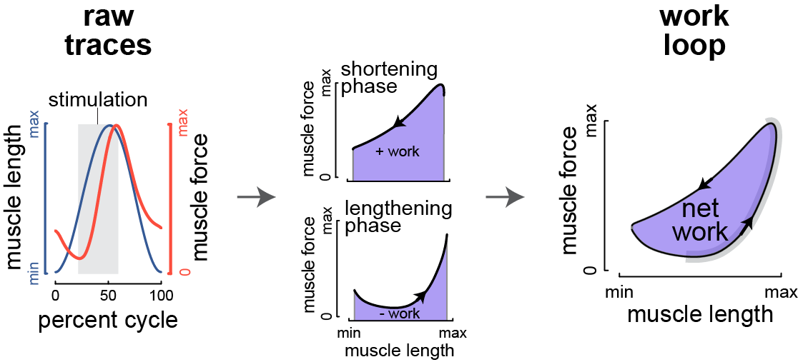

workloopR 
=======================================================================================

  <!-- badges: start -->
[](https://www.repostatus.org/#active)  [](https://ci.appveyor.com/project/vbaliga/workloopR)  [](https://travis-ci.org/vbaliga/workloopR)
[](https://github.com/ropensci/software-review/issues/326)
  <!-- badges: end -->

Analysis of work loops and other data from muscle physiology experiments in R


## Installation

We are not (yet) on CRAN but the package can be installed via:
``` r
#install.packages("devtools") # if devtools is not installed
devtools::install_github("vbaliga/workloopR")
```


## Overview

`workloopR` (pronounced "work looper") provides functions for the import, transformation, and analysis of muscle physiology experiments in R. As the package's title suggests, our initial motivation was to provide functions to analyze work loops. The work loop technique ([Josephson 1985](https://jeb.biologists.org/content/114/1/493)) is used in studies of muscle physiology to determine the mechanical work and power output of a muscle. Over the course of developing the package, we expanded this goal to also cover experiments that are often complementary to the work loop technique. There are three currently supported experiment types: work loop, simple twitch, and tetanus.



For more on work loops, we recommend a great review paper by Ahn ([2012](https://dx.doi.org/10.1242/jeb.062752)) as well as [this](https://en.wikipedia.org/wiki/Work_loop) Wikipedia page.


## Example

`workloopR` offers the ability to import, transform, and then analyze a data file. Here is an example using a work loop file included within the package:

```r
library(workloopR)

## import the workloop.ddf file included in workloopR
wl_dat <- read_ddf(system.file("extdata", "workloop.ddf", 
                               package = 'workloopR'),
                  phase_from_peak = TRUE)

## select cycles 3 through 5 using a peak-to-peak definition
wl_selected <- select_cycles(wl_dat, cycle_def = "p2p", keep_cycles = 3:5)

## apply a gear ratio correction, run the analysis function, 
## and then get the full object
wl_analyzed <- analyze_workloop(wl_selected, GR = 2)
## for brevity, the print() method for this object produces a simple output
wl_analyzed
```
	File ID: workloop.ddf
	Cycles: 3 cycles kept out of 6
	Mean Work: 0.00308 J
	Mean Power: 0.08474 W
```r
## but see the structure for the full output, e.g.
#str(wl_analyzed)

## or run the analysis but get the simplified version
wl_analyzed_simple <- analyze_workloop(wl_selected, simplify = TRUE, GR = 2)
wl_analyzed_simple
```
	  Cycle        Work  Net_Power
	a     A 0.002785397 0.07639783
	b     B 0.003147250 0.08661014
	c     C 0.003305744 0.09122522


## Core features and recommended vignettes

*For an overview, please also see our "Introduction to workloopR" vignette*

**Data import**: Importing data creates objects of class `muscle_stim`, which we designed to essentially behave as `data.frame`s but with unique properties that work nicely with ``workloopR``'s core functions. Data that are stored in .ddf format (e.g. generated by Aurora Scientific's Dynamic Muscle Control and Analysis Software) are easily imported. Other file formats are welcome, but need to be constructed into `muscle_stim` objects by the user; please see the vignette "Importing data from non .ddf sources".

- Example:

```R
## import the workloop.ddf file included in workloopR
wl_dat <- read_ddf(system.file("extdata", "workloop.ddf", 
                               package = 'workloopR'),
                  phase_from_peak = TRUE)

## see how the muscle_stim object is organized
wl_dat
str(wl_dat)
names(attributes(wl_dat))
```


**Data transformations & corrections**: Prior to analyses, data can be transformed or corrected. Should data have been recorded incorrectly, the gear ratio of the motor arm and/or the direction of the muscle's length change can be adjusted. Before analyzing work loop data, cycles within the work loop can be labeled (according to various definitions of what constitutes a "cycle"), which allows calculation of metrics on a per-cycle basis.

- Example:

```R
## correct the gear ratio of the motor arm
## we'll use gear ratio = 2
## this multiples Force by 2 and divides Position by 2
wl_fixed <- fix_GR(wl_dat, GR = 2)
```


**Analyses**: Core data analytical functions include ``analyze_workloop()`` for work loop files and ``isometric_timing()`` for twitch and tetanus trials.

- ``analyze_workloop()`` computes instantaneous velocity, net work, instantaneous power, and net power for work loop trials on a per-cycle basis. See the "Analyzing work loop experiments in workloopR" vignette.

- ``isometric_timing()`` provides summarization of kinetics, i.e. the timing and magnitude of force production at various points within the tetanus or twitch trial. See the "Working with isometric experiments in workloopR" vignette.

- Example:

```R
## import the twitch.ddf file included in workloopR
twitch_dat <- read_ddf(system.file("extdata", "twitch.ddf",
                                   package = 'workloopR'))

## run isometric_timing() to get info on twitch kinetics
## we'll use different set points than the defaults
analyze_twitch <- isometric_timing(twitch_dat,
                                   rising = c(25, 50, 75),
                                   relaxing = c(75, 50, 25))
```


**Batch processing**: We also include functions for batch processing files (e.g. multiple files from a common experiment). These functions allow for the import, cycle selection, gear ratio correction, and ultimately work & power computation for all work loop trial files within a specified directory.  This also allows users to correct for potential degradation of the muscle (according to power & work output) over the course of the experiment. See the "Batch processing" vignette

- Example: 

```R
## batch read and analyze files included with workloopR
analyzed_wls <- read_analyze_wl_dir(system.file("extdata/wl_duration_trials",
                                                package = 'workloopR'),
                                    phase_from_peak = TRUE,
                                    cycle_def = "p2p", keep_cycles = 2:4,
                                    GR = 2)
```


**Plotting**: Although we do not provide plotting functions, all resultant objects are designed to be friendly to visualization via either base-R plotting or `tidyverse` functions. Please see the "Plotting data in workloopR" vignette.


## Graphical overview

Recommended functions and vignettes:


## Citation

The currently preferred way to cite (but subject to change):

Baliga VB, Senthivasan S (2019). _workloopR: Analysis of Work Loops and Other Data from Muscle
Physiology Experiments_. R package version
19.07.19, <URL: https://github.com/vbaliga/workloopR>.


## Issues/questions/requests

Feedback is welcome! Please feel free to get in touch with either Vikram ([@vbaliga](https://github.com/vbaliga)) or Shree ([@shreeramsenthi](https://github.com/shreeramsenthi)).

🐢


## License

GPL (>= 3) + file LICENSE
