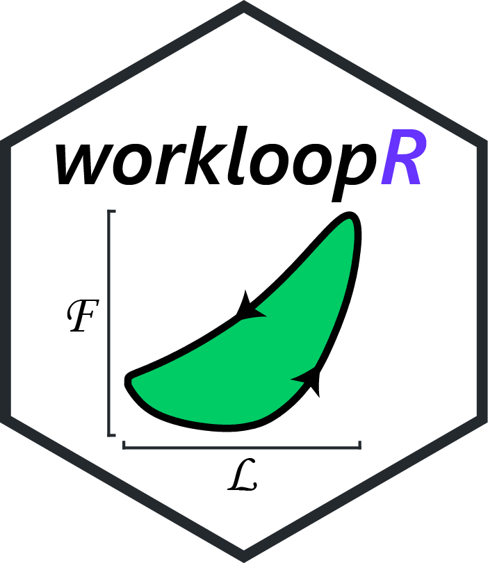

workloopR 
=======================================================================================

Import and analysis of work loop and isometric data in muscle physiology


## Installation
``` r
#install.packages("devtools") # if devtools is not installed
devtools::install_github("vbaliga/workloopR")
```


## Overview

The work loop technique ([Josephson 1985](https://jeb.biologists.org/content/114/1/493)) is used in studies of muscle physiology to determine the mechanical work and power output of a muscle.


``workloopR`` (pronounced "work looper") provides functions for the import, transformation, and analysis of muscle physiology experiments in R. As the package's title suggests, our initial motivation was to provide functions to analyze work loops. Over the course of developing the package, we expanded this goal to cover additional types of experiments that are often complementary to the work loop technique. Accordingly, there are three currently supported experiment types: work loop, simple twitch, and tetanus.


### Example

`workloopR` offers the ability to import, transform, and then analyze a data file. For example, with a work loop file:

```{r a_p_single_file}
library(workloopR)

## import the workloop.ddf file included in workloopR
wl_dat <-read_ddf(system.file("extdata", "workloop.ddf", package = 'workloopR'))

## select cycles 3 through 5 using a peak-to-peak definition
wl_selected <- select_cycles(wl_dat, cycle_def = "p2p", keep_cycles = 3:5)

## apply a gear ratio correction, run the analysis function, 
## and get the full object
wl_analyzed <- analyze_workloop(wl_selected, GR = 2)
## for brevity, the print() method for this object produces a simple output
wl_analyzed
## but see the structure for the full output, e.g.
#str(wl_analyzed)

## or run the analysis but get the simplified version
wl_analyzed_simple <- analyze_workloop(wl_selected, simplify = TRUE, GR = 2)
wl_analyzed_simple
```


### Data import

Importing data creates objects of class `muscle_stim`, which we designed to essentially behave as `data.frame`s but with unique properties that work nicely with ``workloopR``'s core functions. Data that are stored in .ddf format (e.g. generated by Aurora Scientific's Dynamic Muscle Control and Analysis Software) are easily imported. Other file formats are welcome, but need to be constructed into `muscle_stim` objects by the user.


### Data transformations & corrections

Prior to analyses, data can be transformed or corrected. Should data have been recorded incorrectly, the gear ratio of the motor arm and/or the direction of the muscle's length change can be adjusted. Before analyzing work loop data, cycles within the work loop can be labeled (according to various definitions of what constitutes a "cycle"), which allows calculation of metrics on a per-cycle basis.


### Analyses

Core data analytical functions include ``analyze_workloop()`` for work loop files and ``isometric_timing()`` for twitch and tetanus trials. ``analyze_workloop()`` computes instantaneous velocity, net work, instantaneous power, and net power for work loop trials on a per-cycle basis. ``isometric_timing()`` provides summarization of kinetics, i.e. the timing and magnitude of force production at various points within the tetanus or twitch trial.


### Batch processing

We also include functions for batch processing files (e.g. multiple files from a common experiment). These functions allow for the import, cycle selection, gear ratio correction, and ultimately work & power computation for all work loop trial files within a specified directory.  This also allows users to correct for potential degradation of the muscle (according to power & work output) over the course of the experiment.


## Vignettes

Vignettes include:

- Introduction to workloopR
- Importing data from non .ddf sources
- Working with isometric experiments in workloopR
- Analyzing work loop experiments in workloopR
- Batch processing
- Plotting

Please see below for an overview of the ``workloopR`` package with recommended functions and vignettes. 


## Issues/questions/requests

Feedback is welcome! Please feel free to get in touch with either Vikram ([@vbaliga](https://github.com/vbaliga)) or Shree ([@shreeramsenthi](https://github.com/shreeramsenthi)).

🐢

## License

GPL (>= 3) + file LICENSE