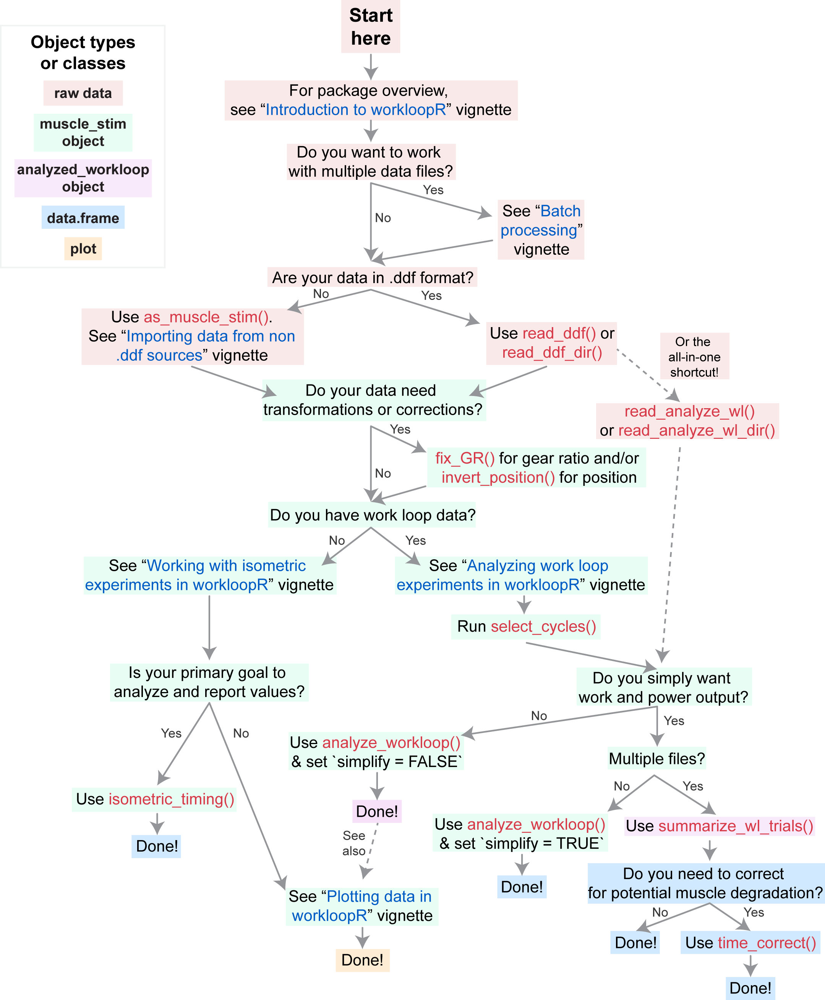

# Summary

The work loop technique [@Josephson:1985] is used in studies of muscle physiology to determine the mechanical work and power output of a muscle. After isolating and attaching the muscle of interest to a servo motor, the motor induces cyclical oscillations of length change to the muscle. An example length change trace is shown in Figure \ref{example-workloop} (blue; one cycle out of several). As this occurs, the muscle is stimulated (grey shading) either directly or via its supplying nerve and the force that is generated is recorded (red trace). Because mechanical work is the product of force and distance, plotting force against length change for a particular cycle yields a "work loop". Work generated during the muscle's shortening phase is considered positive work, whereas work during lengthening is negative. Accordingly, the area enclosed within a work loop is the net work produced during that cycle.

Work loop procedures have powerful experimental value and have been used to understand the characteristics of whole muscles, fiber bundles, and/or single muscle fibers from a wide variety of organisms. Using experimental parameters (e.g. length change amplitude, frequency of stimulation) that correspond to those shown by an organism *in vivo* can help explain muscle performance in the context of natural behavior. But since these experimental parameters do not need to be constrained to those shown during *in vivo* behaviors, the work loop technique affords the ability to explore a muscle's properties beyond (some) natural physiological constraints. @Ahn:2012 provides a review of the work loop technique's importance to the field of muscle physiology.

The ability to import and analyze data from work loop (or other muscle physiology ) experiments has been conspicuously absent from open-source environments. ``workloopR`` (pronounced "work looper") provides functions for the import, transformation, and analysis of muscle physiology experiments in R. As the package's title suggests, our initial motivation was to provide functions to analyze work loops to determine net work and power output from the time-course of length and force change. Over the course of developing the package, we expanded this goal to cover additional types of experiments that are often complementary to the work loop technique. Accordingly, there are three currently supported experiment types: work loop, simple twitch, and tetanus.

Importing data via functions within the package creates objects of class ``muscle_stim``, which we designed to essentially behave as ``data.frame``s but with unique properties that work nicely with ``workloopR``'s core functions. Several of our functions are designed to parse information stored in .ddf format (e.g. generated by Aurora Scientific's Dynamic Muscle Control and Analysis Software). Time-course data on muscle length change, force development, and stimulation pattern are then imported as a ``muscle_stim`` object and important metadata and protocol information (e.g. specifics of the stimulus train) are stored in the object's attributes. File formats other than .ddf are welcome, but need to be coerced into ``muscle_stim`` objects by the user using the ``as_muscle_stim()`` function.

Prior to analysis, data can be transformed or corrected. Should metadata have been recorded incorrectly, the gear ratio of the motor arm and/or the direction of the muscle's length change can be adjusted. Before analyzing work loop data, cycles within the work loop can be labeled (according to various definitions of what constitutes a "cycle"), which allows calculation of metrics on a per-cycle basis.

Core data analytical functions include ``analyze_workloop()`` for work loop files and ``isometric_timing()`` for twitch and tetanus trials. ``analyze_workloop()`` computes instantaneous velocity, net work, instantaneous power, and net power for work loop trials on a per-cycle basis. ``isometric_timing()`` provides summarization of kinetics, i.e. the timing and magnitude of force production at various points within the tetanus or twitch trial.

We also include functions for batch processing files (e.g. multiple files from a common experiment). These functions allow for the import, cycle selection, gear ratio correction, and ultimately work & power computation for all work loop trial files within a specified directory.  Our batch analytical pipeline also allows users to correct for potential degradation of the muscle (according to power & work output) over the course of the experiment.

Although we do not provide plotting functions, all ``muscle_stim`` or ``data.frame`` objects produced by our analytical functions are designed to be friendly to visualization via either base-R plotting or `tidyverse` functions.

Please see Figure \ref{flowchart} below for an overview of the ``workloopR`` package with recommended functions and vignettes.

# Acknowledgements

We thank Doug Altshuler, Jasmin Wong, and Jolan Theriault for help they provided throughout the course of this project.

# References
